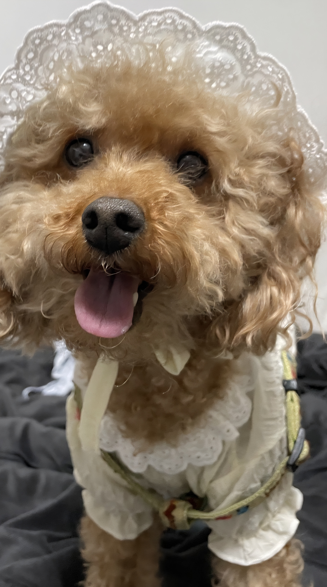

## 안녕 난 정은영이야 👋

   

   

**jeyoung4224-rgb/jeyoung4224-rgb** is a ✨ _special_ ✨ repository because its `README.md` (this file) appears on your GitHub profile.

---

### 진행중인 프로젝트

   

https://github.com/jeyoung4224-rgb/myfirstREPO
   1. 어쩌구
   2. 도리

   

   

---
Here are some ideas to get you started:

- 🔭 I’m currently working on ...
- 🌱 I’m currently learning ...
- 👯 I’m looking to collaborate on ...
- 🤔 I’m looking for help with ...
- 💬 Ask me about ...
- 📫 How to reach me: ...
- 😄 Pronouns: ...
- ⚡ Fun fact: ...

